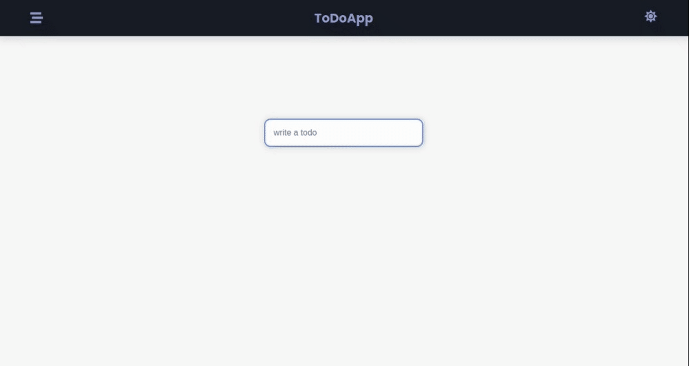

# LarnU Fullstack Bootcamp

## EXPRESS, MONGODB API

Backend for React TodoList with Typescript project using hooks and controlled components, 

Express, mongoDB, mongoose to store todosList.
CRUD application for "https://github.com/CesarAugusto316/react_context" frontEnd

- npm i
- npm run dev

